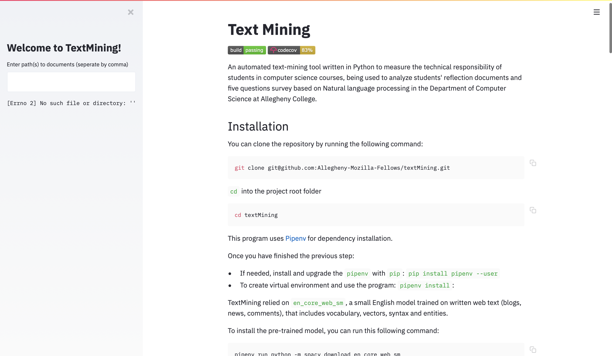
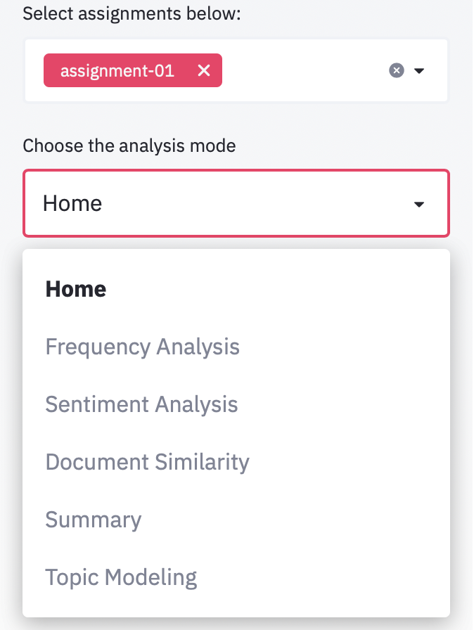

# Text Mining
[](https://travis-ci.com/Allegheny-Mozilla-Fellows/textMining)
[](https://codecov.io/gh/Allegheny-Mozilla-Fellows/textMining)

An automated text-mining tool written in Python to measure the technical
responsibility of students in computer science courses, being used to analyze
students' reflection documents and five questions survey based on Natural language
processing in the Department of Computer Science at Allegheny College.


## Installation

You can clone the repository by running the following command:

```bash
git clone git@github.com:Allegheny-Mozilla-Fellows/textMining.git
```

`cd` into the project root folder

```bash
cd textMining
```

This program uses [Pipenv](https://github.com/pypa/pipenv) for dependency installation.

Once you have finished the previous step:

- If needed, install and upgrade the `pipenv` with `pip`:

  ```bash
  pip install pipenv --user
  ```

- To create virtual environment and use the program:

  ```bash
  pipenv install
  ```

textMining relies on `en_core_web_sm`, a small English model trained on
written web text (blogs, news, comments), that includes vocabulary, vectors,
syntax and entities.

To install the pre-trained model, you can run this following command:

```bash
pipenv run python -m spacy download en_core_web_sm
```

## Web Interface

textMining is mainly developed on its web interface with [Streamlit](https://www.streamlit.io)
in order to provide fast analysis and visualizations.

In order to run Streamlit, type and run the following command in your terminal.

```bash
pipenv run streamlit run streamlit_web.py
```

You then will see something like this

```
You can now view your Streamlit app in your browser.

Local URL: http://localhost:8501
Network URL: http://192.168.0.3:8501
```

as well as the web app in your browser:



You can then start to use the tool by typing in the path(s) to the directories
that hold reflection documents. You are welcome to use the sample documents we
provided in `resources`. You can then navigate through the select box in the
sidebar to view the analysis:



## Command Line Interface

- To learn about the command line interface of textMining, type in
`pipenv run python textmining.py -h` in the terminal.

  ```bash
  $ pipenv run python textmining.py -h

  usage: textmining.py [-h] [--directory DIRECTORY] [--function FUNCTION]

  optional arguments:
    -h, --help            show this help message and exit
    --directory DIRECTORY
                          Directory with mardown documents to analyze (default: None)
    --function FUNCTION   Function to analyze (frequency/summary) (default: None)

  Sample usage: python3 textmining.py --directory /path/to/markdown_directory --function frequency
  ```

- For a sample input diretory, use `resources/cs100f2019_lab05_reflections`

- Sample usage -> run frequency analysis:

  ```bash
  $ pipenv run python textmining.py --directory resources/cs100f2019_lab05_reflections --function frequency

  [('editing', 213), ('genome', 202), ('technology', 181), ('dna', 135), ('string', 107), ('random', 96), ('harm', 93), ('use', 89), ('code', 86), ('program', 81), ('lab', 76), ('assignment', 74), ('complete', 66), ('cause', 64), ('practice', 63), ('experience', 62), ('learn', 59), ('task', 59), ('letter', 58), ('challenge', 52), ('method', 51), ('make', 51), ('want', 50), ('value', 49), ('like', 48), ('run', 47), ('team', 47), ('character', 46), ('technical', 44), ('people', 44), ('position', 44), ('great', 43), ('change', 42), ('user', 40), ('face', 39), ('add', 38), ('replace', 38), ('think', 37), ('way', 37), ('java', 37), ('new', 37), ('class', 36), ('gene', 35), ('command', 35), ('display', 34), ('solution', 34), ('avoid', 33), ('overcome', 32), ('output', 31), ('work', 31)]

  ```

## Contribute

In order to contribute code or documentation to the project, we encourage you to
install the development dependencies with `pipenv` as follows:

```bash
pipenv install --dev --skip-lock
```

If you want to add a new feature, please ensure that it is
accompanied by high coverage test cases and that you do not break any of the
existing test cases or features.

You can follow these steps to make a branch and add a new feature if you are
already a collaborator on the project. First, you should type the following
command, substituting the name of your feature for the word `featurename`.

```bash
git checkout -b new-featurename
git checkout master
git push -u origin new-featurename
```

You can also create a fork of the repository and make contributions on your own
fork. You might want to configure an upstream remote repository for your fork of
`textMining`, so that you can sync changes from the main project back
into your fork. `textMining` is configured to use `TravisCI` to test and create
builds for every commit and pull requests. You may want to set up `TravisCI` on
your own fork to enable continuous integration for your development process.

You should open a pull request on the GitHub repository for the new branch or
the fork that you have created once you are ready to merge them into the
master branch of the main project. This pull request should describe the changes
that it will make to the project.

We expect your Pull Respect is passing the build. We hope your code is tested
and well documented. You can run the test suites locally as follows:

```bash
pipenv run pytest
```

It might also be helpful for you to run this following command to see the test
coverage and lines that are missing test:

```bash
pipenv run pytest --cov-config pytest.cov --cov --cov-report term-missing
```

Besides, you are also welcome to reporting issues, including both feature
requests and bug reports. Feedback is greatly appreciated if you are using
our tool.
