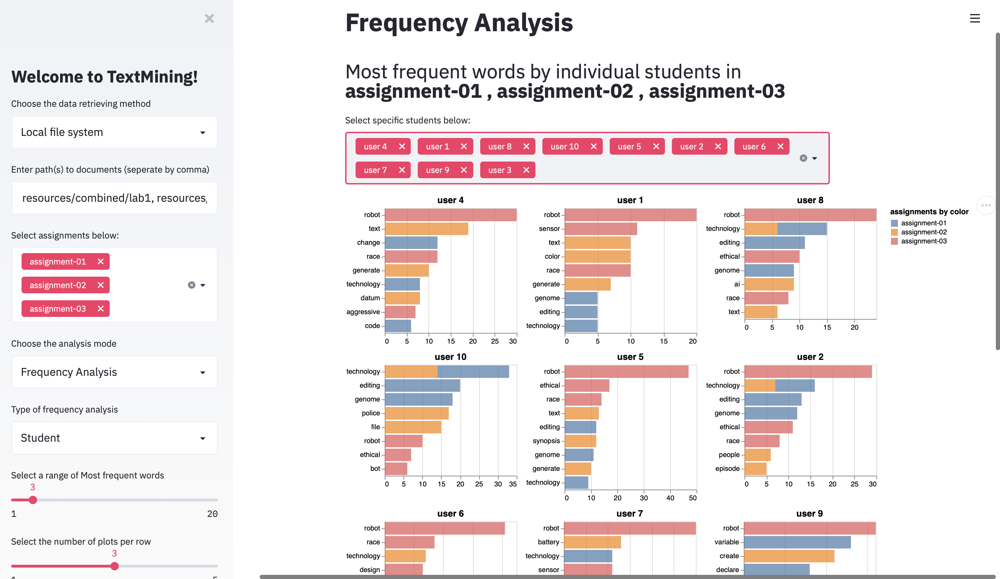
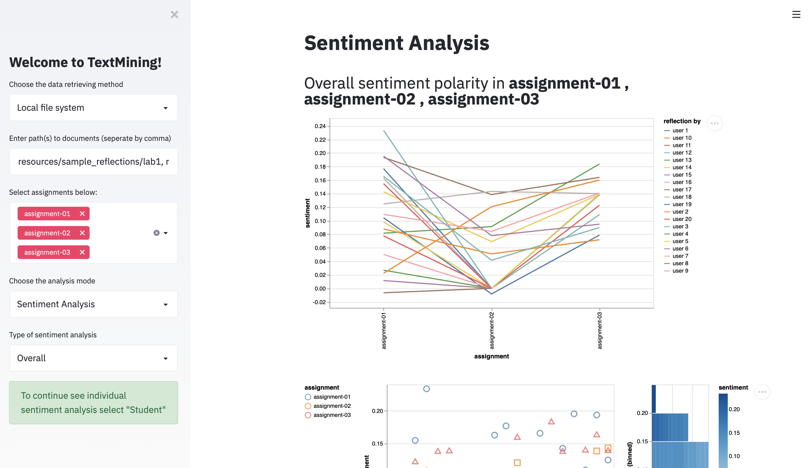
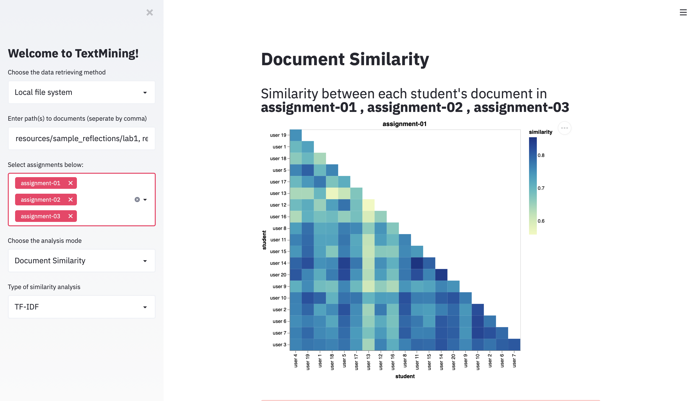
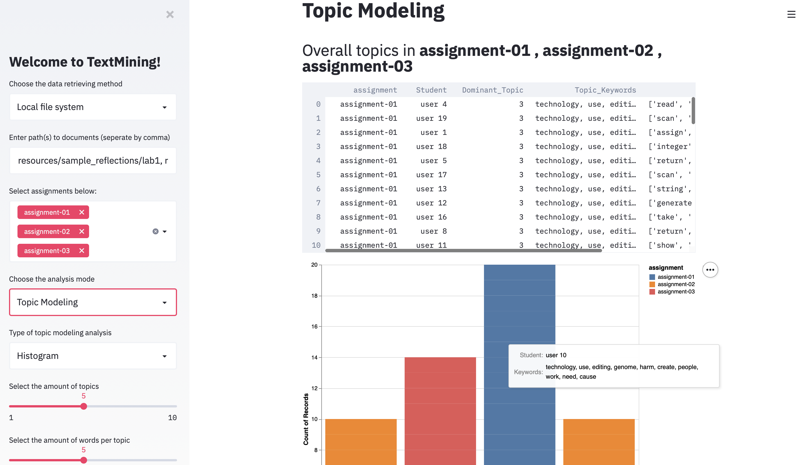

# GatorMiner

[](https://travis-ci.com/Allegheny-Ethical-CS/GatorMiner)
[](https://codecov.io/gh/Allegheny-Ethical-CS/GatorMiner)
[](https://spacy.io)
[](https://www.streamlit.io/)

An automated text-mining tool written in Python to measure the technical
responsibility of students in computer science courses, being used to analyze
students' markdown reflection documents and five questions survey based on
Natural Language Processing in the Department of Computer Science at Allegheny
College.

## Installation

You can clone the repository by running the following command:

```bash
git clone git@github.com:Allegheny-Ethical-CS/GatorMiner.git
```

`cd` into the project root folder:

```bash
cd GatorMiner
```

This program uses [Pipenv](https://github.com/pypa/pipenv) for dependency management.

- If needed, install and upgrade the `pipenv` with `pip`:

  ```bash
  pip install pipenv --user
  ```

- To create a virtual environment and use the program:

  ```bash
  pipenv install
  ```

GatorMiner relies on `en_core_web_sm` and `en_core_web_md`, English models trained on
written web text (blogs, news, comments) that includes vocabulary, vectors,
syntax and entities.

To install the pre-trained model, you can run the following command:

```bash
pipenv run python -m spacy download en_core_web_sm
pipenv run python -m spacy download en_core_web_md
```

## Web Interface

GatorMiner is mainly developed on its web interface with [Streamlit](https://www.streamlit.io)
in order to provide fast text analysis and visualizations.

In order to run the `Streamlit` interface, type and execute the following command
in your terminal:

```bash
pipenv run streamlit run streamlit_web.py
```

You then will see something like this in your terminal window:

```bash
You can now view your Streamlit app in your browser.

Local URL: http://localhost:8501
Network URL: http://xxx.xxx.x.x:8501
```

The web interface will be automatically opened in your browser:


### Data Retreiving

There are currently two ways to import text data for analysis: through local
file system or AWS DynamoDB.

#### Local File System

You can type in the path(s) to the directorie(s) that hold reflection markdown
documents. You are welcome to try the tool with the sample documents we
provided in `resources`, for example:

```shell
resources/sample_md_reflections/lab1, resources/sample_md_reflections/lab2, resources/sample_md_reflections/lab3
```

#### AWS

Retrieving reflection documents from AWS is a feature integrated with the use
of [GatorGrader](https://github.com/GatorEducator/gatorgrader) where students'
markdown reflection documents are being collected and stored inside the a
pre-configured DynamoDB database. In order to use this feature, you will need
to have some credential tokens (listed below) stored as environment variables:

```bash
export GATOR_ENDPOINT=<Your Endpoint>
export GATOR_API_KEY=<Your API Key>
export AWS_ACCESS_KEY_ID=<Your Access Key ID>
export AWS_SECRET_ACCESS_KEY=<Your Secret Access Key>
```

It is likely that you already have these prepared when using GatorMiner in
conjunction with GatorGrader, since these would already be exported when
setting up the AWS services. You can read more about setting up an AWS service
with GatorGrader [here](https://github.com/enpuyou/script-api-lambda-dynamodb).

Once the documents are successfully imported, you can then navigate through
the select box in the sidebar to view the text analysis:


##### Reflection Documents

We are using markdown format for the student reflection documents.
Its organized structure allows us to parse and perform text analysis easily. With that
said, there are few requirements for the reflection document before it could be
seamlessly processed and analyzed with GatorMiner. A
[template](resources/reflection_template.md) is provided within the repo. Note
that the headers with the assignment's and student's ID/name are required.
GatorMiner is set in default to take the first header as assignment name and the
second header as student name.

You can also check out the
[sample json report](resources/sample_json_report/report%201.json) to see the
format of json reports GatorMiner gathers from AWS.

### Analysis






### Contribution

We are excited that you would take the time to contribute to GatorMiner! We have
provided a [contributing guideline](CONTRIBUTING.md) that will help you
effectively get started and make contributions to the project.
